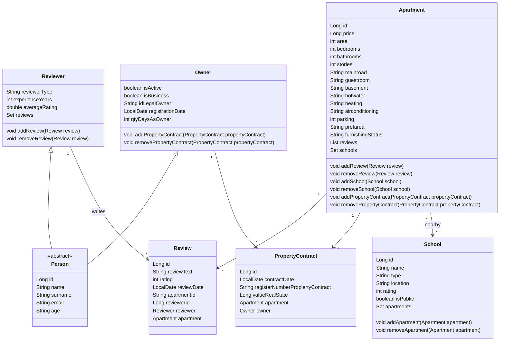

# ApartmentPredictor-Spring-Backend

## Product Goal

The main objective of this exercise is to create a RestController which would include a method that populates all database tables, including each assignment.

## Project classes

### Apartment (1.2)

```java
@Entity
public class Apartment {

    @Id
    @GeneratedValue(strategy = GenerationType.IDENTITY)
    private Long id;
    private Long price;
    private int area;
    private int bedrooms;
    private int bathrooms;
    private int stories;
    private String mainroad;
    private String guestroom;
    private String basement;
    private String hotwater;
    private String heating;
    private String airconditioning;
    private int parking;
    private String prefarea;
    private String furnishingStatus;

    @OneToMany(mappedBy = "apartment", cascade = CascadeType.ALL, orphanRemoval = true)
    private Set <Review> reviews = new HashSet<>();

    @OneToMany(mappedBy = "apartment", cascade = CascadeType.ALL)
    private Set <PropertyContract> propertyContracts = new HashSet<>();

    @ManyToMany
    @JoinTable(
            name = "apartment_school_joinTable",
            joinColumns = @JoinColumn(name = "aparment_id"),
            inverseJoinColumns = @JoinColumn(name = "school_id"))
    private Set<School> schools = new HashSet<>();
}
```

### Person (1.0)

```java
@MappedSuperclass
public abstract class Person {

    @Id
    @GeneratedValue(strategy = GenerationType.IDENTITY)
    private Long id;
    private String name;
    private String surname;
    private String email;
    private int age;
}
```

### Owner (1.1)

```java
@Entity
public class Owner extends Person {

    private boolean isActive;
    private boolean isBusiness;
    private String idLegalOwner;
    private LocalDate registrationDate;
    private int qtyDaysAsOwner;

    @OneToMany(mappedBy = "owner", cascade = CascadeType.ALL)
    private Set<PropertyContract> propertyContracts = new HashSet<>();
}
```

### Reviewer (1.2)

```java
@Entity
public class Reviewer extends Person{

    private String reviewerType;
    private int experienceYears;
    private double averageRating;

    @OneToMany(mappedBy = "reviewer", cascade = CascadeType.ALL, orphanRemoval = true)
    private Set<Review> reviews = new HashSet<>();
}
```

### Review (1.2)

```java
@Entity
public class Review {

    @Id
    @GeneratedValue(strategy = GenerationType.IDENTITY)
    private Long id;
    private String reviewText;
    private int rating;
    private LocalDate reviewDate;

    @ManyToOne(fetch = FetchType.LAZY)
    @JoinColumn(name = "reviewer_id", nullable = false)
    @JsonIgnore
    private Reviewer reviewer;

    @ManyToOne(fetch = FetchType.LAZY)
    @JoinColumn(name = "apartment_id", nullable = false)
    @JsonIgnore
    private Apartment apartment;
```

### School (1.1)

```java
@Entity
public class School {

    @Id
    @GeneratedValue(strategy = GenerationType.IDENTITY)
    private Long id;
    private String name;
    private String type;
    private String location;
    private int rating;
    private boolean publicSchool;

    @ManyToMany (mappedBy = "schools")
    private Set<Apartment> apartments = new HashSet<>();
}
```

### PropertyContract (1.1)

```java
@Entity
public class PropertyContract {

    @Id
    @GeneratedValue(strategy = GenerationType.IDENTITY)
    private Long id;
    private LocalDate contractDate;
    private String registerNumberPropiertyContract;
    private Long valueRealState;

    @ManyToOne(fetch = FetchType.LAZY)
    @JoinColumn(name = "apartment_id")
    @JsonIgnore
    private Apartment apartment;

    @ManyToOne(fetch = FetchType.LAZY)
    @JoinColumn(name = "owner_id")
    @JsonIgnore
    private Owner owner;
}
```

## UML (1.3)


