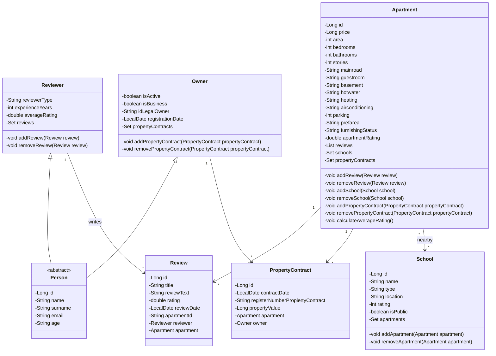

# ApartmentPredictor-Spring-Backend

## Product Goal

The current goal of this project is to expose a functional REST API for managing aparments, including CRUD operations and querys, using Spring Boot, JPA and H2 database.

The API will be tested using Postman and the Service methods with @SpringBootTest.

## UML


```mermaid
classDiagram
direction TB
    class Person {
        -Long id
        -String name
        -String surname
        -String email
        -String age
    }

    class Reviewer {
        -String reviewerType
        -int experienceYears
        -double averageRating
        -Set <Review> reviews
        -void addReview(Review review)
        -void removeReview(Review review)
    }

    class Owner {
        -boolean isActive
        -boolean isBusiness
        -String idLegalOwner
        -LocalDate registrationDate
        -Set <PropertyContract> propertyContracts
        -void addPropertyContract(PropertyContract propertyContract)
        -void removePropertyContract(PropertyContract propertyContract)
    }

    class Review {
        -Long id
        -String title
        -String reviewText
        -double rating
        -LocalDate reviewDate
        -String apartmentId
        -Reviewer reviewer
        -Apartment apartment
    }

    class Apartment {
        -Long id
        -Long price
        -int area
        -int bedrooms
        -int bathrooms
        -int stories
        -String mainroad
        -String guestroom
        -String basement
        -String hotwater
        -String heating
        -String airconditioning
        -int parking
        -String prefarea
        -String furnishingStatus
        -double apartmentRating
        -List <Review> reviews
        -Set <School> schools
        -Set <PropertyContract> propertyContracts
        -void addReview(Review review)
        -void removeReview(Review review)
        -void addSchool(School school)
        -void removeSchool(School school)
        -void addPropertyContract(PropertyContract propertyContract)
        -void removePropertyContract(PropertyContract propertyContract)
        -void calculateAverageRating()
    }

    class PropertyContract {
        -Long id
        -LocalDate contractDate
        -String registerNumberPropiertyContract
        -Long propertyValue
        -Apartment apartment
        -Owner owner
    }

    class School {
        -Long id
        -String name
        -String type
        -String location
        -int rating
        -boolean isPublic
        -Set <Apartment> apartments
        -void addApartment(Apartment apartment)
        -void removeApartment(Apartment apartment)
    }

    <<abstract>> Person

    Reviewer <|-- Person
    Owner <|-- Person
    Reviewer "1" --> "*" Review : writes
    Apartment "1" --> "*" Review
    Apartment "1" --> "*" PropertyContract
    Owner "1" --> "*" PropertyContract
    Apartment "*" --> "*" School : nearby
```

## ApartmentPredictor-Spring-Backend Entities

### Apartment (1.4)

```java
@Entity
public class Apartment {

    @Id
    @GeneratedValue(strategy = GenerationType.IDENTITY)
    private Long id;
    private Long price;
    private int area;
    private int bedrooms;
    private int bathrooms;
    private int stories;
    private String mainroad;
    private String guestroom;
    private String basement;
    private String hotwater;
    private String heating;
    private String airconditioning;
    private int parking;
    private String prefarea;
    private String furnishingStatus;
    private double apartmentRating;

    @OneToMany(mappedBy = "apartment", cascade = CascadeType.ALL, orphanRemoval = true)
    private Set <Review> reviews = new HashSet<>();

    @OneToMany(mappedBy = "apartment", cascade = CascadeType.ALL, orphanRemoval = true)
    private Set <PropertyContract> propertyContracts = new HashSet<>();

    @ManyToMany (fetch = FetchType.EAGER)
    @JoinTable(
            name = "apartment_school_joinTable",
            joinColumns = @JoinColumn(name = "apartment_id"),
            inverseJoinColumns = @JoinColumn(name = "school_id"))
    private Set<School> schools = new HashSet<>();
}
```

### Person (1.0)

```java
@MappedSuperclass
public abstract class Person {

    @Id
    @GeneratedValue(strategy = GenerationType.IDENTITY)
    private Long id;
    private String name;
    private String surname;
    private String email;
    private int age;
}
```

### Owner (1.3)

```java
@Entity
public class Owner extends Person {

    private boolean isActive;
    private boolean isBusiness;
    private String idLegalOwner;
    private LocalDate registrationDate;

    @OneToMany(mappedBy = "owner", cascade = CascadeType.ALL, orphanRemoval = true)
    private Set<PropertyContract> propertyContracts = new HashSet<>();
}
```

### Reviewer (1.3)

```java
@Entity
public class Reviewer extends Person{

    private String reviewerType;
    private int experienceYears;
    private double averageRating;

    @OneToMany(mappedBy = "reviewer", cascade = CascadeType.ALL, orphanRemoval = true)
    @JsonIgnore
    private Set<Review> reviews = new HashSet<>();
}
```

### Review (1.4)

```java
@Entity
public class Review {

    @Id
    @GeneratedValue(strategy = GenerationType.IDENTITY)
    private Long id;
    private String title;
    private String reviewText;
    private double rating;
    private LocalDate reviewDate;

    @ManyToOne(fetch = FetchType.LAZY)
    @JoinColumn(name = "reviewer_id", nullable = false)
    private Reviewer reviewer;

    @ManyToOne(fetch = FetchType.LAZY)
    @JoinColumn(name = "apartment_id", nullable = false)
    @JsonIgnore
    private Apartment apartment;
}
```

### School (1.2)

```java
@Entity
public class School {

    @Id
    @GeneratedValue(strategy = GenerationType.IDENTITY)
    private Long id;
    private String name;
    private String type;
    private String location;
    private int rating;
    private boolean publicSchool;

    @ManyToMany (mappedBy = "schools")
    @JsonIgnore
    private Set<Apartment> apartments = new HashSet<>();
}
```

### PropertyContract (1.2)

```java
@Entity
public class PropertyContract {

    @Id
    @GeneratedValue(strategy = GenerationType.IDENTITY)
    private Long id;
    private LocalDate contractDate;
    private String registerNumberPropertyContract;
    private Long propertyValue;

    @ManyToOne(fetch = FetchType.LAZY)
    @JoinColumn(name = "apartment_id")
    @JsonIgnore
    private Apartment apartment;

    @ManyToOne(fetch = FetchType.LAZY)
    @JoinColumn(name = "owner_id")
    @JsonIgnore
    private Owner owner;
}
```

## ApartmentPredictor-Spring-Backend RestController

### PopulateDBController

```java
@RestController
@RequestMapping("/api/v1/")
public class PopulateDBController {

    @Autowired
    PopulateDB populateDB;

    @PostMapping("/populate")
    public String populateDB (@RequestParam int quantity) {
        populateDB.populateAll(quantity);
        return "DataBase populated with " + quantity + " objects per entity.";
    }
}
```

## To Do List (Future implementations)

- Implement service classes for business logic

- Add additional RestControllers for each main entity

- Implement defensive programming practices

- Explore more JPA inheritance strategies

- Test the differents entities, classes and methods with @SpringBootTest and validate endpoints with Postman

- Create new git branches to try the diferent query approaches
